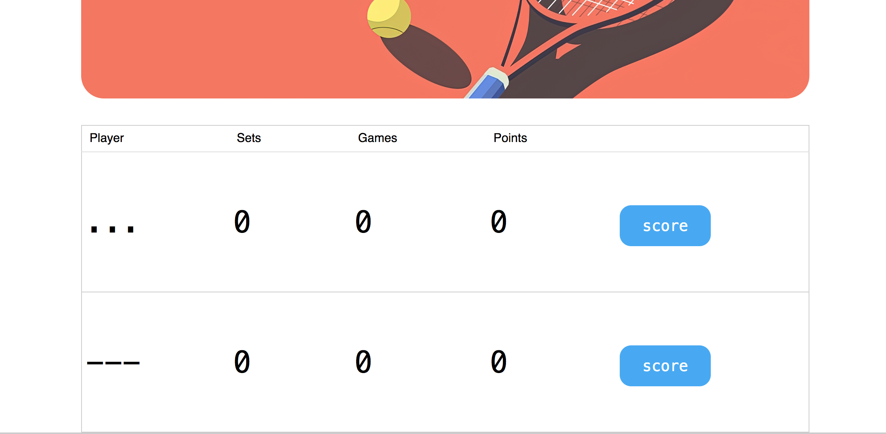
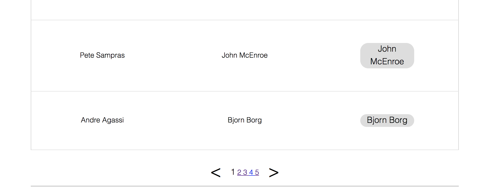
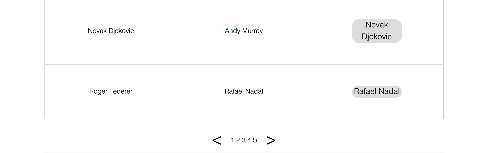
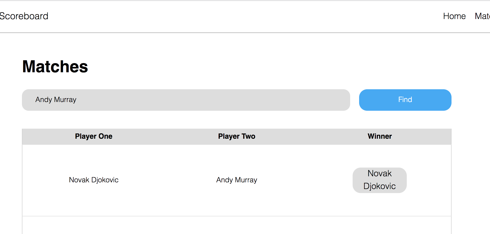
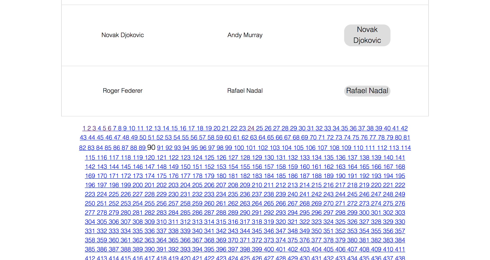

```text
Знаком ❗️ помечены критически важные замечания, а также места нарушения ТЗ.
```

## Функциональный обзор

- Сейчас можно создать игроков с такими именами:



Раз в проекте есть валидация, стоит добавить проверку, что в имени есть буквы.

- Кнопки '<' и '>' отображаются и являются активными даже на первой и последней странице





- Нет кнопки сброса фильтра по имени игрока.



После фильтрации матчей должна быть возможность вернуться к полному списку, сбросив фильтр. Сейчас это можно сделать обходным путём — если очистить поле ввода имени и нажать "Find".

Лучше добавить специальную кнопку сброса фильтра.

- ❗️В пагинации на странице завершённых матчей отображаются все страницы, что плохо выглядит при большом количестве страниц.



Лучше сделать отображение текущей и +-2 страниц вокруг неё.

